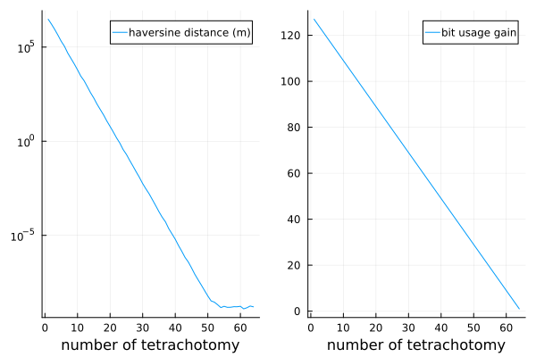

# GeoTetrachotomy

_Representing Geographic Points Using Earth's Tetrachotomy_

# WORK IN PROGRESS
``+ i code like shit so be nice``

This repo is meant (for now ?) as a demostration, toy model, and not a all a production ready framework. 

## 1. Concept

The main idea is to represent geographic data, more specifically geographic points (from which we can derive lines and polygons) using what is called here '_tetrachotomy_'. 

To illustrate this, lets take the [Bisection method](https://en.wikipedia.org/wiki/Bisection_method): it allows finding the root of a function using successives dichotomies, the root can then either be described as a real number, or one can describe this root using the sucessive dichotomies used to find it. For example if we note 0 (resp. 1) at every step if the root is in the left (resp. right) half of the segment, then the root can be encoded as (e.g.) 01001, meaning here that we did 5 dichotomies and the root we found was "left, right, left, left, right".

Here the tetrachotomy comes from the fact that we do this dichotomy find on both the latitude and the longitude (EPSG:4326, WGS84) of a given geographic point, leading to a division in 4 quadrants. 

## 2. Why ? 

It seems from afar that it could lead to a more compact way of representing geopoints compared to the classical (Float64, Float64) enconding that takes 128 bytes to store one point. This repo aims at answering at least partly to this interrogation. Well, its probably pointless since float64 compression algorithms are very efficient, but it's a fun concept to explore and gives a nice, more human readable bit representation of geographical data.  

## 3. How ?

main idea
-> represent geographic data using a number of tetrachotomy, subdivisions in 4 quadrants. 

example: 
-> 

why ? 
-> well it's fun + i believe it can lead to a very compact way of representing geopoints

why not other methods ?
-> well i'm pretty sure other methods such as using fractals of different shape n-chotometry could lead to more compact representation, but this one seems to be the easiest to implement

why julia
-> well i like it