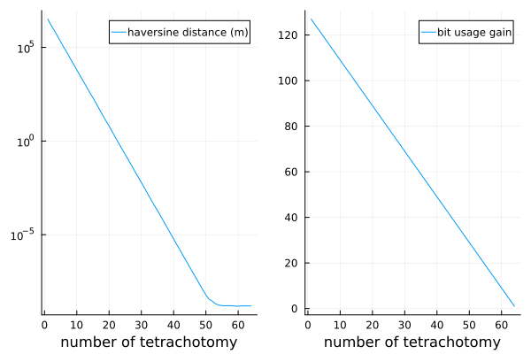

# GeoTetrachotomy

_Representing Geographic Points Using Earth's Tetrachotomy_

# WORK IN PROGRESS
``+ i code like shit so be nice``

This repo is meant (for now ?) as a demostration, toy model, and not a all a production ready framework. 

## 1. Concept

The main idea is to represent geographic data, more specifically geographic points (from which we can derive lines and polygons) using what is called here '_tetrachotomy_'. 

To illustrate this, lets take the [Bisection method](https://en.wikipedia.org/wiki/Bisection_method): it allows finding the root of a function using successives dichotomies, the root can then either be described as a real number, or one can describe this root using the sucessive dichotomies used to find it. For example if we note 0 (resp. 1) at every step if the root is in the left (resp. right) half of the segment, then the root can be encoded as (e.g.) 01001, meaning here that we did 5 dichotomies and the root we found was "left, right, left, left, right".

Here the tetrachotomy comes from the fact that we do this dichotomy find on both the latitude and the longitude (EPSG:4326, WGS84) of a given geographic point, leading to a division in 4 quadrants. 

## 2. Why ? 

It seems from afar that it could lead to a more compact way of representing geopoints compared to the classical (Float64, Float64) enconding that takes 128 bytes to store one point. This repo aims at answering at least partly to this interrogation. Well, its probably pointless since float64 compression algorithms are very efficient, but it's a fun concept to explore and gives a nice, more human readable bit representation of geographical data. Other methods using fractal representations, other shapes than quadrants can also be used (I guess?), but it's nowhere near as simple. Also it is in Julia because I like Julia :) I will maybe do a Python implemntation someday (probably not).

## 3. How ?

This section describes the data structure that is a '_tetra_' (the writing '_tetraN_' can also represent the base4-bit precision of this data structure e.g. tetra8, tetra16, tetra27 ...etc)

### 3.1 

- First, to adress the fact that the segment length of latitude is 180° (-90, 90) while longitude is 360 (-180, 180) or (0, 360), the first bit of a tetra is 0 (resp. 1) if located in the western (resp. eastern) hemisphere lon(-180, 0) (resp. lon(0, +180)). After this first dichotomy is done, we can now proceed to tetrachotomies with equal segment lengts for latitude and longitude.
- ...Etc

### 3.2 Example
``1 10 01 11 00 11 00``
- 1st bit tells us its in the eastern hemisphere
- 1st pair of bits (lat: 1, lon: 0) tells us the tetrachotomy lead us to the north-western quadrant
- 2nd pair of bits (lat: 0, lon: 1) --> south-east sub-quadrant
- ...etc 

In base 4:
- We replace the first bit by ``-`` (resp. ``+``) if it is in the western (resp. eastern) hemisphere. Ìn other words``0 -> -``, ``1 -> +``. 
- The pairs of bits are represented in base 4

->``+213030``

This can also be interpreted as a list of directions:

-> ``E NW SE NE SW NE SW``

## 4. Is it efficient ? 

In this figure, left subplot shows the haversine distance in m (computed using Distances.jl) between a Point(Float64, Float64) and its Tetra representation, based on the number of tetrachotomy performed. On the right it shows the amount of _uncompressed_ bit that the tetra representation saves based on the number of tetrachotomy. This was computed on 1000 random geopoints per amount of tetrachotomy. 

The number of spared bits is easy to compute: 
- An uncompressed pair of float64 numbers occupy ``64 + 64 = 128``bits
- A tetraN object occupies ``2*N+1`` bits (1 bit for the first dichotomy, N for lat, N for lon) - _if we have a tetra64 object, it is bigger than two float64 ojects by one bit_.
- So the right curve formula is ``y = 128-(2*x+1)``,  

As it is a dichotomy, the exponential slope of the left curve (linear because of the log scale) is not surprising since the interval size is divided by ``1/2^i`` at step ``i`` compared to the original one. 

At around 25 tetrachotomy, the haversine distance is sub-metric, which is more than enough for most GIS applications, while using roughly 60% less bits. This is of course a WIP, and the code isnt the most clean, but i will continue looking into it. 

